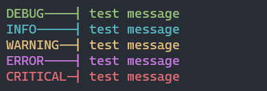
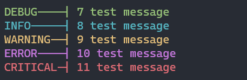

# Overview
* Setting up logging sucks, this makes it easier

# Features
* Simple logger set up
* Creates log directory and filename as described in [`Log` initialization](#use)
* Prints all log entries to the terminal in **color** for easier debugging
* Promotes logging **during** development, not after. Reduce your tech debt.

# Use
## Standard Use
```python
from logg3r import Log

logger = Log(log_path="./path-to/log-directory", name="test_log", level=1)

logger.debug("test message")
logger.info("test message")
logger.warning("test message")
logger.error("test message")
logger.critical("test message")
```
### Log file example `test_log.log`
```
2023-07-29 03:13:27 | DEBUG | test message
2023-07-29 03:13:27 | INFO | test message
2023-07-29 03:13:27 | WARNING | test message
2023-07-29 03:13:27 | ERROR | test message
2023-07-29 03:13:27 | CRITICAL | test message
```

### Terminal Example


<br>

## Log with line numbers  - **recommended**
```python
from logg3r import Log

logger = Log(log_path="./path-to/log-directory", name="test_log", level=1)
line = logger.line #must be called from the line being logged


logger.debug(line()+"test message")
logger.info(line()+"test message")
logger.warning(line()+"test message")
logger.error(line()+"test message")
logger.critical(line()+"test message")
```
### Log file example `test_log.log`
```
2023-07-29 03:30:25 | DEBUG | 7 test message
2023-07-29 03:30:25 | INFO | 8 test message
2023-07-29 03:30:25 | WARNING | 9 test message
2023-07-29 03:30:25 | ERROR | 10 test message
2023-07-29 03:30:25 | CRITICAL | 11 test message
```


### Terminal Example


<br><br>

# Initialization Keyword Arguments
## Required
### `log_path` (string)
* If the path does not exist (and `create_path` is not `False`) **logg3r** will create the directory

### `name` (string)
* Sets the name of your log file - file will present as "filename.log" in your log directory

### `level` (integer)
* See [log levels](#log-levels)
* Sets minimum level of log message that will be stored in the log file (all log function calls print to terminal)

## Optional
### `print_filename` (bool)
```python
from logg3r import Log

Logger = Log(log_path="./path-to/log-directory",
			name="test_log",
			level=1,
			print_filename=True)
```
* Defaults to `False`
* If enabled, the filename will print in the first section of the log message in the terminal - the filename will not be written to the log file

### `formatter` (string)
```python
from logg3r import Log
fmt='{} | %(levelname)s | %(message)s '.format(datetime.datetime.utcnow().replace(microsecond=0))

Logger = Log(log_path="./path-to/log-directory",
			name="test_log",
			level=1,
			formatter=fmt)
```
* The formatter can be any string you like
  * `%(levelname)s` is **required** and corresponds to the [log level](#log-levels)
  * `%(message)s` is **required** and is the message passed when calling any of the log functions
  * In the example above the date and time are represented at `{}` and formatted with `.format(datetime.datetime.utcnow().replace(microsecond=0))`
  * Any other string elements can be added to the formatter

### `rotation` (tuple)
```python
from logg3r import Log
rotation_args=filename,when='d',interval=30,backupCount=1,encoding=None,delay=False,utc=True,atTime=datetime.time(4, 0, 0)

Logger = Log(log_path="./path-to/log-directory,
			name="test_log",
			level=1,
			rotation=rotation_args)
```
* See [Python Logging TimedRotatingFileHandler](https://docs.python.org/3.8/library/logging.handlers.html#timedrotatingfilehandler)
* Defaults to 30 days of retention with (1) log overflow file (log.1)

### `create_path` (bool)
* Defaults to `True`
* If set to `False` initializing **logg3r** will not create a new log directory, but will put the file in the directory passed to `log_path`

<br><br>

# Log Levels
* `1` = DEBUG (green)
* `2` = INFO (cyan)
* `3` = WARNING (yellow)
* `4` = ERROR (magenta)
* `5` = CRITICAL (red)

<br><br>

# `logg3r.Log` Functions
## `.debug`
* Creates [debug level](#log-levels) log message entry to log file
* Prints message in color to terminal
```python
logger.debug("log message")
```
## `.info`
* Creates [info level](#log-levels) log message entry to log file
* Prints message in color to terminal
```python
logger.info("log message")
```

## `.warning`
* Creates [warning level](#log-levels) log message entry to log file
* Prints message in color to terminal
```python
logger.warning("log message")
```

## `.error`
* Creates [error level](#log-levels) log message entry to log file
* Prints message in color to terminal
```python
logger.error("log message")
```

## `.critical`
* Creates [critical level](#log-levels) log message entry to log file
* Prints message in color to terminal
```python
logger.critical("log message")
```

## `.line`
* Returns line number of the code where the function is called - unfortunately this couldn't be integrated automatically because the function must be called from the line being logged
```python
line = logger.line
logger.debug(line()+"log_message")
```
<br><br>

# References
* https://docs.python.org/3.8/library/logging.handlers.html#timedrotatingfilehandler
* https://docs.python.org/3.8/library/logging.html